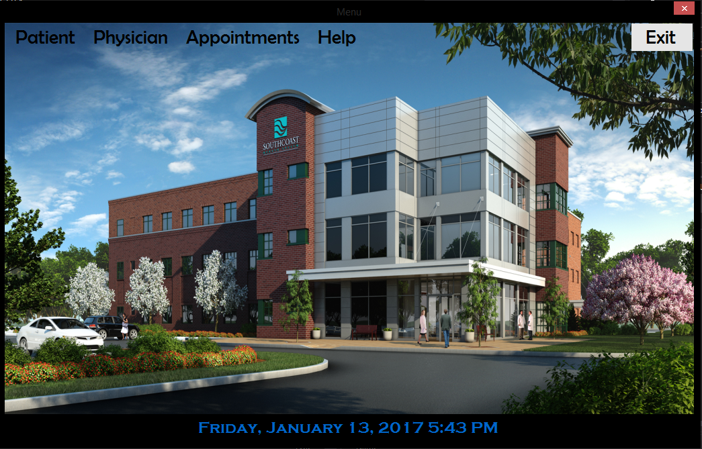
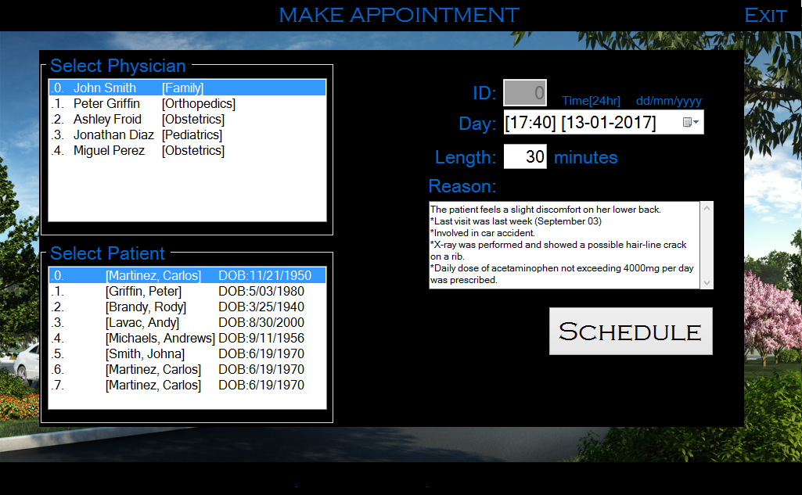

A common task for all medical offices is that of scheduling appointments. This application will handle all the tasks associated with scheduling. This program was built in steps. Each user interface had to be attractive, easy to use and understandable, also impervious to runtime errors. Included are user menus and toolbars that will permit later expansion of the program.

Part 1: Collect Patient Information: Build a user interface that collects information about a patient. Create a Patient class containing the following data: ID, first name, last name, date of birth, phone, email, insurance provider (if any), type of plan (HMO/PPO), subscriber ID, and plan ID. The patient's ID must be unique.

Part 2: Create a Patient List: Store the Patient objects in a List and serialize the list to an XML file.

Part 3: Create a Physician List: Create a Physician class containing ID (unique), first name, last name, and specialty. Create an enumerated type containing the following medical specialties: Family, Obstetrics, Pediatrics, and Orthopedics.
