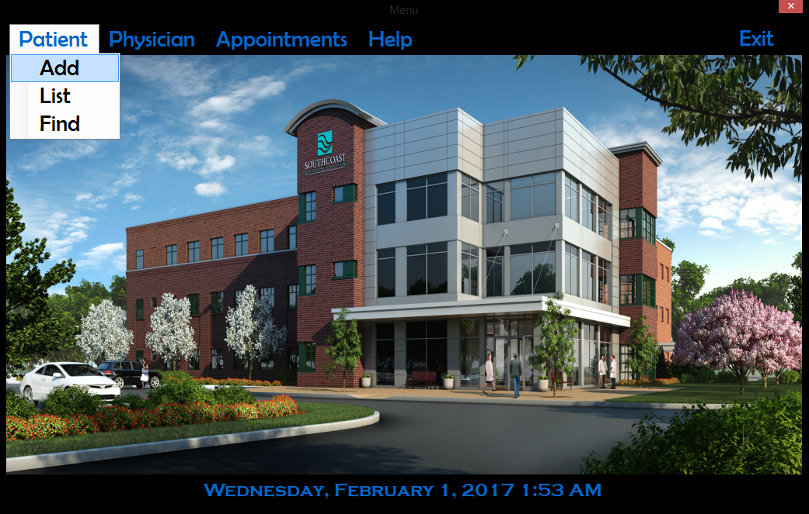
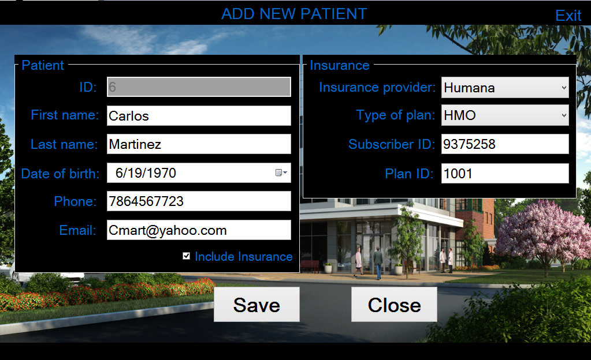
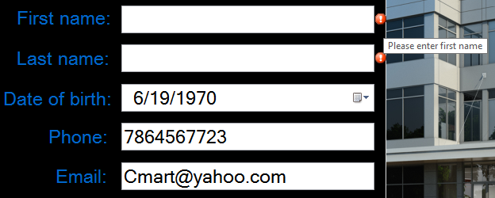
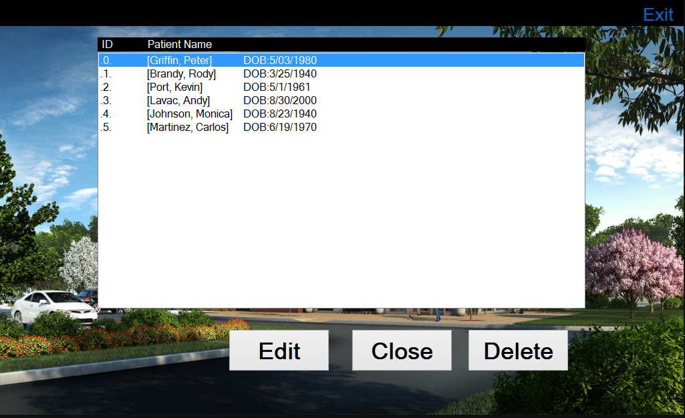
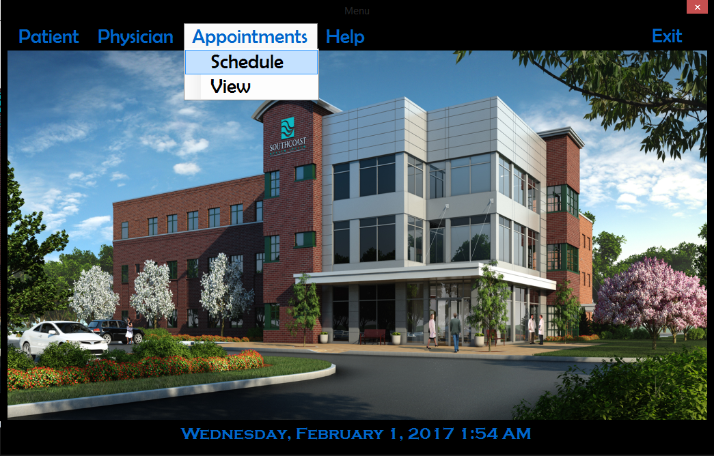
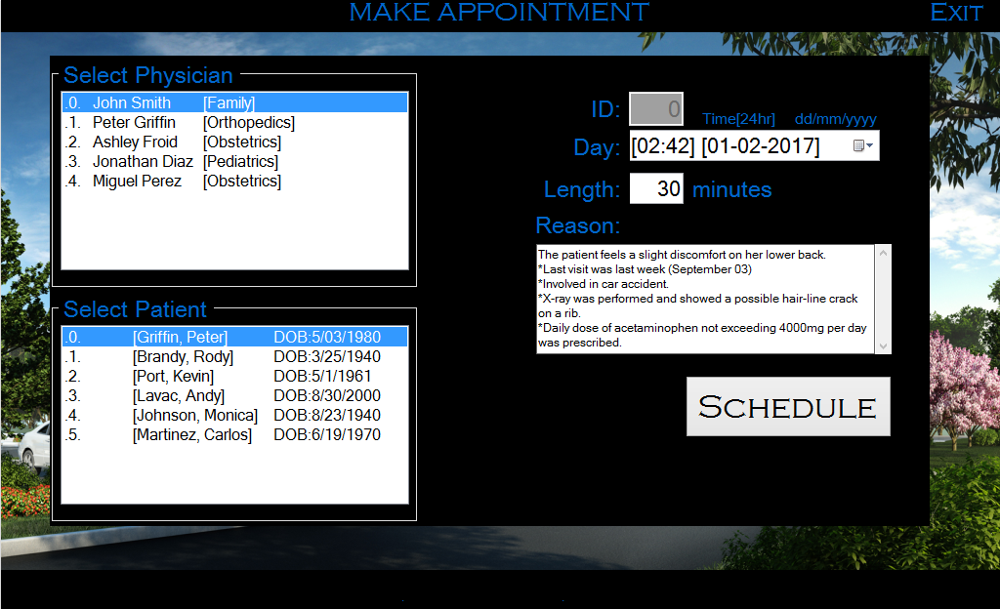
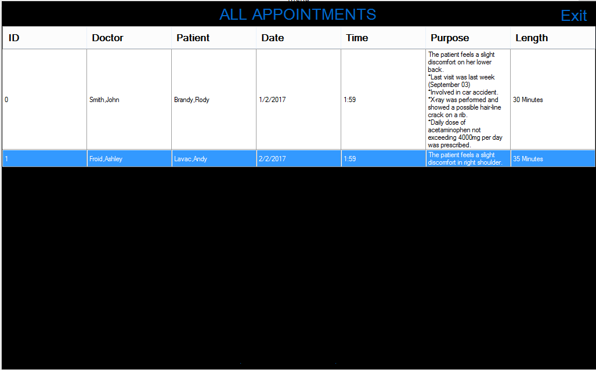

A common task for all medical offices is that of scheduling appointments. This application will handle all the tasks associated with scheduling. This program was built in steps. Each user interface had to be attractive, easy to use and understandable, also impervious to runtime errors.

Main screen provides user with multiple dropdown menus. These include all options to [add|view|edit] patients, physicians and Appointments.

The user interface collects:
ID, first name, last name, date of birth, phone, email, insurance provider (if any), type of plan (HMO/PPO), subscriber ID, plan ID and unique patient ID.

All required fields are checked for correct input.

Patient List can be accessed and each patient's information can be edited. These patient objects are in a list that is serialized to an XML file.

Appointments can be made by selecting Physician and Patient. Length,date and reason for appointment are also provided.

